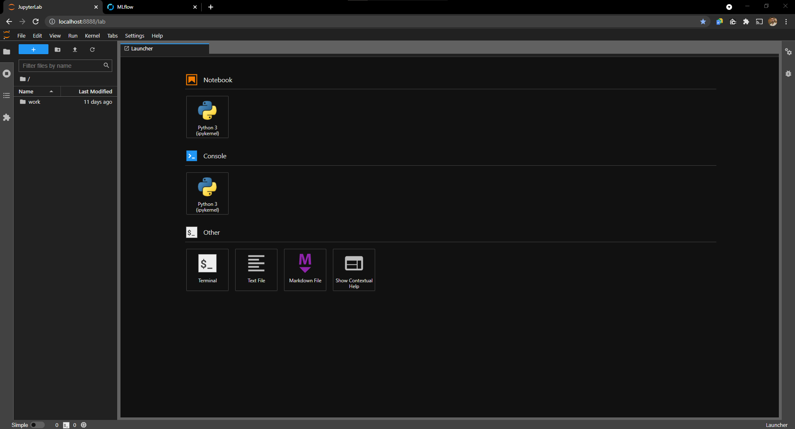
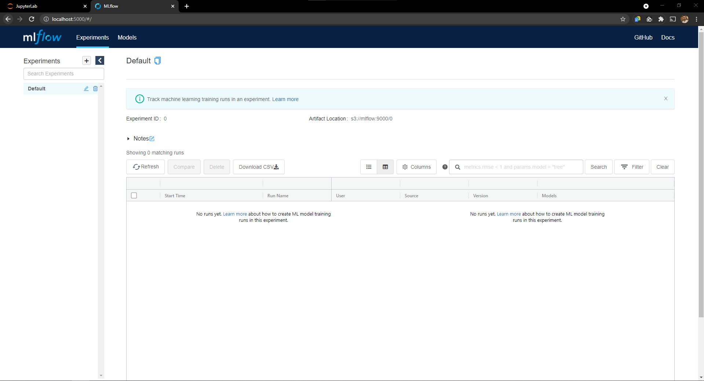
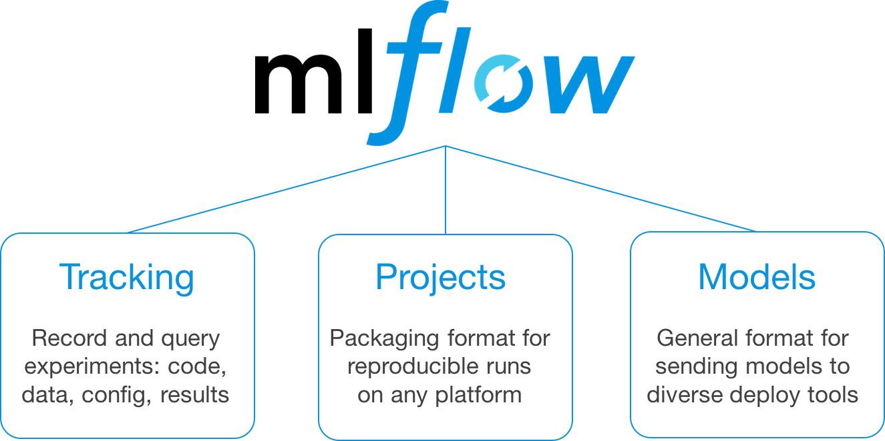

# Data Science stack

This Docker Compose stack is a collection of services that can be used to run a Data Science environment.

| **JupyterLab** | **MLFlow Server** |
| :-: | :-: |
|  |  |

## Prerequisites

- [Docker](https://www.docker.com/products/docker-desktop)
- [Docker Compose](https://docs.docker.com/compose/install/)

On desktop systems like Docker Desktop for Mac and Windows, Docker Compose is included as part of those desktop installs.

## Services 

### [MLFlow](https://mlflow.org/)

MLflow is an open source platform to manage the ML lifecycle, including experimentation, reproducibility, deployment, and a central model registry. MLflow currently offers four components:

- [[MLflow Tracking](https://mlflow.org/docs/latest/tracking.html)]{Record and query experiments: code, data, config, and results|top-right}
- [[MLflow Projects](https://mlflow.org/docs/latest/projects.html)]{Package data science code in a format to reproduce runs on any platform|top-right}
- [[MLflow Models](https://mlflow.org/docs/latest/models.html)]{Deploy machine learning models in diverse serving environments|top-right}
- [[Mlflow Registry](https://mlflow.org/docs/latest/model-registry.html)]{Store, annotate, discover, and manage models in a central repository|top-right}



### [JupyterLab](https://jupyter.org/)

JupyterLab is a web-based interactive development environment for Jupyter notebooks, code, and data. JupyterLab is flexible: configure and arrange the user interface to support a wide range of workflows in data science, scientific computing, and machine learning. JupyterLab is extensible and modular: write plugins that add new components and integrate with existing ones.


### [Dataiku Data Science Studio (DSS)](https://www.dataiku.com/)

Dataiku enables you to create, share, and reuse applications that leverage data and machine learning to extend and automate decision making.

## Project setup

### Environment variables

You need to set the following [environment variables](https://docs.docker.com/compose/environment-variables/) to use this [Docker Compose](https://docs.docker.com/compose/).

The best way to do this is to add them to a `.env` file in the same directory as `docker-compose.yml`.

<details><summary>.env</summary>
<p>

```properties
MLFLOW_PORT=5000
MLFLOW_DB_USERNAME=mlflow
MLFLOW_DB_PASSWORD=mlflow
MLFLOW_DB_DATABASE=mlflow
MLFLOW_DB_PORT=5432

MINIO_ACCESS_KEY=minio
MINIO_SECRET_KEY=minio123

JUPYTERLAB_PORT=8888
JUPYTERLAB_TOKEN=''
JUPYTERLAB_PASSWORD=''
```

</p>
</details>

### Docker Compose up

To run all the required services, execute the following command:

```bash
docker-compose up
```

[Dataiku Data Science Studio (DSS)](https://www.dataiku.com/) is an optional service. To run the stack with it, execute the following command:

```bash
docker-compose --profile dataiku up
```

You can now access the following endpoints:

| Endpoint | Description |
| - | - |
| [http://localhost:8888/](http://localhost:8888/) | JupyterLab |
| [http://localhost:5000/](http://localhost:5000/) | MLflow UI |
| [http://localhost:11000/](http://localhost:11000/) | Dataiku (optional) |

## Next features

Add optional [profiles](https://docs.docker.com/compose/profiles/) with more tools such as:

- [Airflow](https://airflow.apache.org/) - Develop, schedule, and monitor workflows
- [Redash](https://redash.io/) - Visualization tool
- [Postgres](https://www.postgresql.org/) - Relational Database
- [Feast](https://feast.dev/) - Feature Store
  
So you can up your stack with optional tools using the same docker-compose.yml file.

```bash
docker-compose --profile airflow --profile feast up
```

The result of this command will launch JupyterLab, MLFlow Server (with its postgres and minio), Kubeflow and Redash.

## Change Log

All notable changes to this project will be documented in this file.

The format is based on [Keep a Changelog](https://keepachangelog.com/en/1.0.0/), and this project adheres to [Semantic Versioning](https://semver.org/spec/v2.0.0.html).

### 1.1.0 (2021-08-15)

- Added Dataiku service as a profile `--profile dataiku`.

### 1.0.0 (2021-08-07)

Initial release with the following features:

- MLflow Tracking Server.
- JupyterLab.
- GitHub Page with the documentation.
- GitHub Actions (CI) to verify the docker-compose.yml file and deploy the documentation.